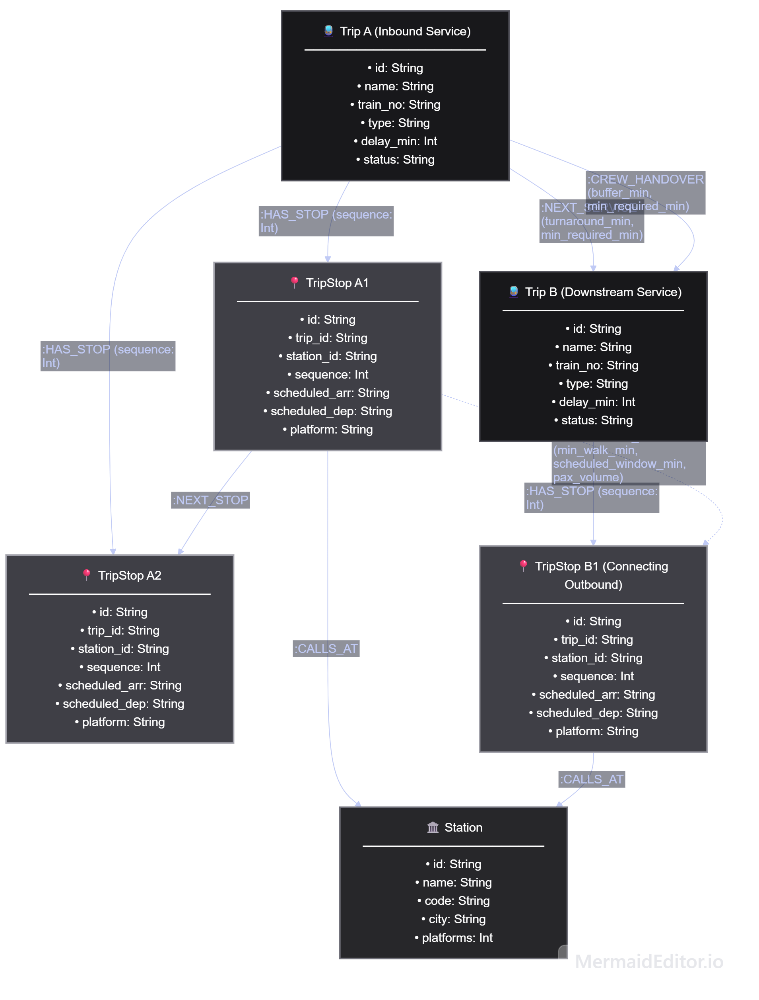
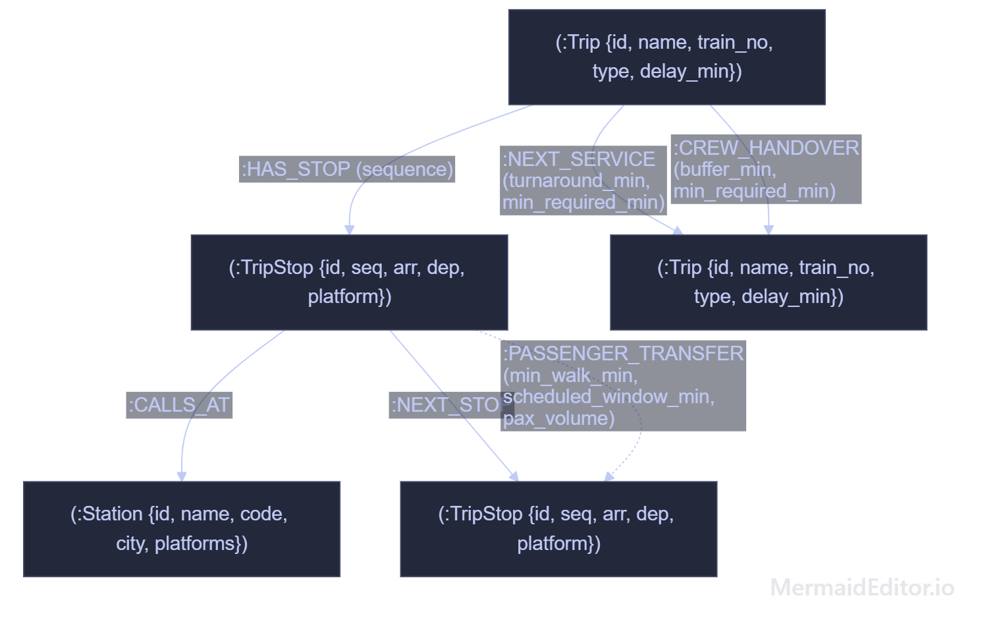
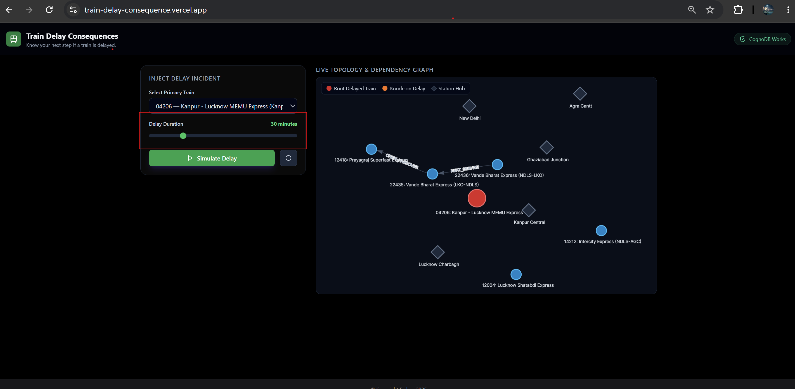
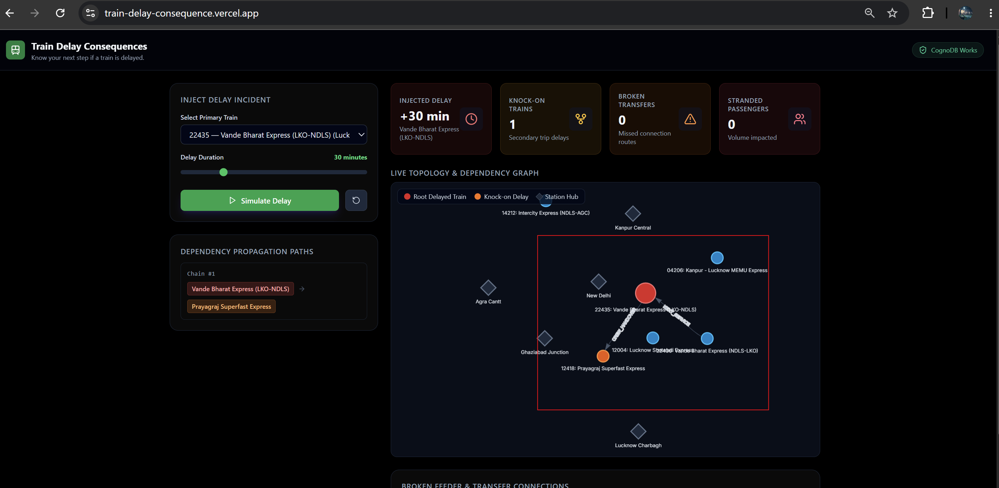
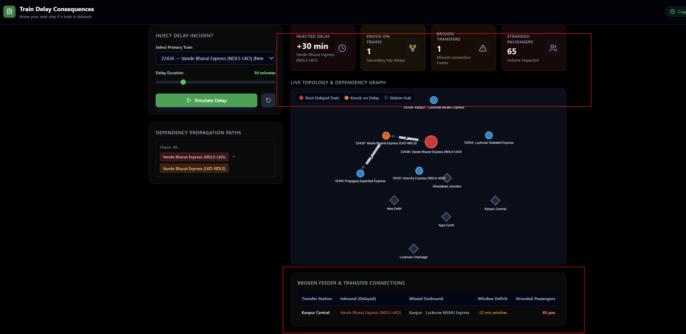

# Train-delay-Consequence

## Live Application & Demo

* **Live Demo App:** `https://train-delay-consequence.vercel.app/`
* **Video Walkthrough (Loom):** `TDB` 

---

## 📑 Table of Contents
1. [Why a Graph Database?](#-why-a-graph-database)
2. [Graph Data Model](#-graph-data-model)
3. [Core Cypher Queries Explained](#-core-cypher-queries-explained)
4. [CognoDB Cloud Setup](#-cognoDB-cloud-setup)
5. [Local Installation & Seeding](#-local-installation--seeding)
6. [Application UI & Architecture](#-application-ui--architecture)

---

##  Why a Graph Database?

A rail network is physically a graph. Stations and trains are the nodes, and tracks, driver shifts, and passenger transfers are edges. With this, it would be much easier to trace a delay chain that takes one simple Cypher query (*1..4), whereas SQL needs complex and slow recursive joins (WITH RECURSIVE) and also involves many table joins. Whereas in a graph database, one direct path match gives us the answer, as they follow direct pointers between connected items instantly.

---

## Graph Data Model
The graph data model represents a railway network using 3 types of Nodes (station, trip, tripstop ) and 6 types of Relationships 
  (:Trip)-[:HAS_STOP]->(:TripStop): Links a train route to all its scheduled stops.
  (:TripStop)-[:CALLS_AT]->(:Station): Connects a stop event to the physical station building.
  (:TripStop)-[:NEXT_STOP]->(:TripStop): Connects consecutive stops in sequential order ($1 \to 2 \to 3$)
  (:Trip)-[:NEXT_SERVICE]->(:Trip) (Same Train Cars): Links trips sharing the same train rake; delay cascades if turnaround time is exceeded.
  (:Trip)-[:CREW_HANDOVER]->(:Trip) (Same Driver): Links trips where the loco pilot/guard steps off one train to operate the next.
  (:TripStop)-[:PASSENGER_TRANSFER]->(:TripStop) (Passenger Walk): Cross-platform walking route; breaks if inbound delay exceeds the transfer window..

Full Architecture diagram:
  

Model diagram

## core-cypher-queries-explained

 This query traces how a delay propagates across shared rakes (:NEXT_SERVICE) and loco pilot handovers (:CREW_HANDOVER) across 1 to 4 steps:

 MATCH path = (root:Trip {id: $trip_id})-[:NEXT_SERVICE|CREW_HANDOVER*1..4]->(downstream:Trip)
WITH path, relationships(path) AS rels, nodes(path) AS trips
RETURN 
    [t IN trips | t.id] AS trip_ids,
    [t IN trips | t.name] AS trip_names,
    [t IN trips | t.train_no] AS train_numbers,
    [r IN rels | {
        type: type(r),
        buffer: coalesce(r.turnaround_min, r.buffer_min, 0),
        min_req: coalesce(r.min_required_min, 0)
    }] AS hop_details,
    length(path) AS total_hops
ORDER BY total_hops DESC;

It traverses variable-length paths (*1..4) dynamically in one step. In SQL, doing this requires complex and slow recursive CTEs (WITH RECURSIVE).

Query 2: something that might be akward in SQL
MATCH (inTrip:Trip)-[:HAS_STOP]->(inStop:TripStop)-[conn:PASSENGER_TRANSFER]->(outStop:TripStop)<-[:HAS_STOP]-(outTrip:Trip)
MATCH (inStop)-[:CALLS_AT]->(stn:Station)
WHERE inTrip.id IN $delayed_trip_ids
RETURN 
    inTrip.id AS inbound_trip_id,
    inTrip.name AS inbound_train,
    outTrip.id AS outbound_trip_id,
    outTrip.name AS outbound_train,
    stn.name AS station_name,
    conn.scheduled_window_min AS scheduled_window,
    conn.min_walk_min AS min_walk,
    conn.pax_volume AS pax_volume;

This query matches late incoming trains, checks platform transfer walking windows, and finds departing connecting trains.

if we used SQL, this required joining about 6 tables across forigen keys and composit keys. where as in graphdb, its just one readable path pattern. 

## cognoDB-cloud-setup

1. Create an account. Go to https://console.cognodb.com/signup and sign up. The free tier requires no
credit card.
2. Create a free instance. From the console, create a free (c0) instance and pick a region. It provisions in
under a minute. Each workspace gets one free instance.
3. Save your connection details. You will get a connection URI of the form
bolt+s://<instance-id>.databases.cognodb.cloud and a generated password for the user "cognodb". The
password is shown exactly once — copy or download it immediately and store it where your code reads
its secrets.
4. Connect with an official Neo4j driver. Install the official Neo4j driver for your language, point it at your
bolt+s:// URI with username "cognodb" and your saved password, and run your first Cypher query. No
other code changes are needed.

## local-installation--seeding

Backend Setup:

Bash
cd backend
python -m venv venv
source venv/bin/activate  # On Windows: venv\Scripts\activate
pip install -r requirements.txt
python seed.py
uvicorn main:app --reload --port 8000

Frontend Setup:

Bash
cd frontend
npm install
npm run dev

## application-ui--architecture

Delay Controls: Dropdown to pick an active train and a slider to inject $+5$ to $+120$ minutes of delay.

Topology Visualizer: Interactive vis-network canvas color-coding root delayed trains (Red), secondary knock-on trains (Orange), and station hubs (Grey).

Metrics Cards: Real-time counters for affected downstream trains, broken transfer windows, and total stranded passengers.

